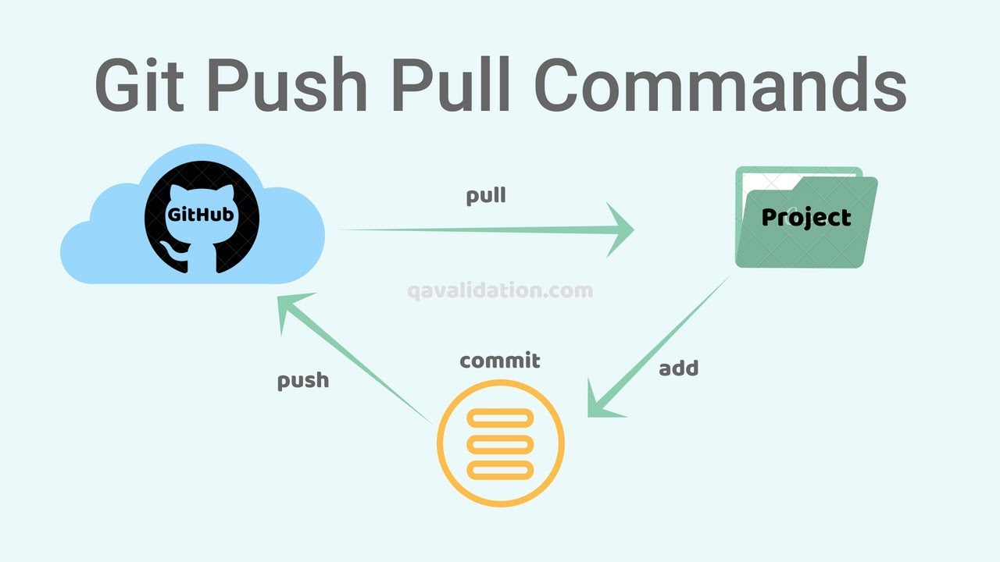

# Tech201_github
## Heading 2
### Heading 3

<<<<<<< HEAD

- Lets create our markdown file
- This line is added on local host 

Step 1: Open Git Bash
Step 2: git clone  (Find link on code page of github)
Step 3: p = shows current directory which you are navigating.

